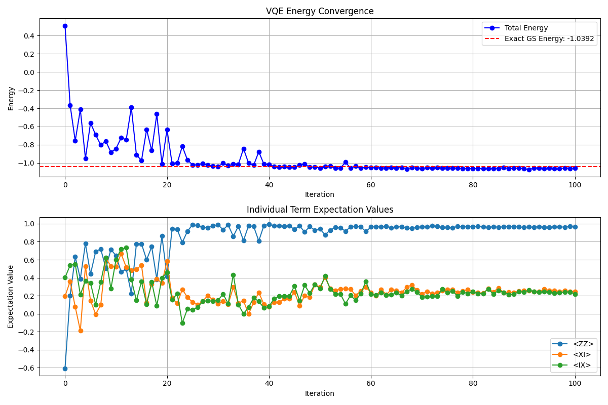
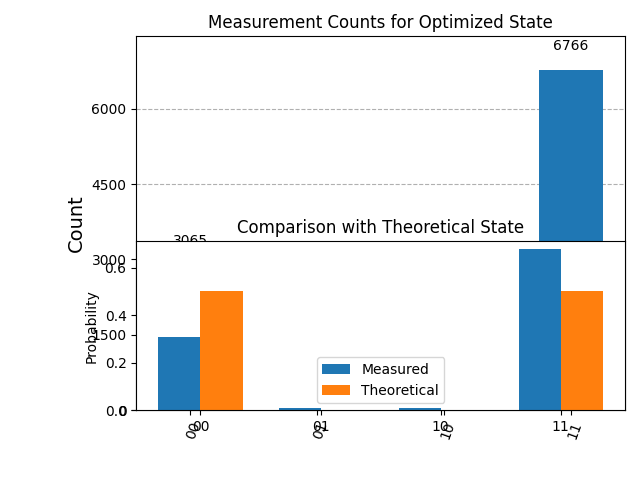

# Quantum Computing Tutorials

This repository contains a series of Jupyter notebooks and Python scripts designed to introduce you to quantum computing concepts and the Variational Quantum Eigensolver (VQE) algorithm using Qiskit.

## Table of Contents

1. [Prerequisites](#prerequisites)
2. [Installation](#installation)
3. [Tutorial Files](#tutorial-files)
   - [Intro to Quantum Computing](#intro-to-quantum-computing)
   - [VQE on IBM Quantum Hardware](#vqe-on-ibm-quantum-hardware)
   - [Excited States](#excited-states)
   - [Local VQE Simulation](#local-vqe-simulation)
4. [Tutorial Learning Steps](#tutorial-learning-steps)
5. [Visualizations](#visualizations)
6. [Understanding the VQE Code](#understanding-the-vqe-code)
7. [Next Steps](#next-steps)
8. [Additional Resources](#additional-resources)
9. [Conclusion](#conclusion)

## Prerequisites

To get the most out of these tutorials, you should have:
- Basic understanding of linear algebra (matrices, eigenvalues, vector spaces)
- Familiarity with Python programming
- Basic knowledge of quantum mechanics (helpful but not required)

## Installation

To run these tutorials, you'll need:

```bash
# Create a virtual environment (recommended)
python -m venv qc_env
source qc_env/bin/activate  # On Windows, use: qc_env\Scripts\activate

# Install required packages
pip install qiskit qiskit-aer matplotlib numpy scipy jupyter qiskit-ibm-runtime pylatexenc 
```

## Tutorial Files

### Intro to Quantum Computing

**File**: `intro.ipynb`

This introductory notebook covers the fundamentals of quantum computing, including:
- Quantum bits (qubits) and their properties
- Quantum gates and circuits
- Quantum measurement
- Basic quantum algorithms

Start here if you're new to quantum computing.

### VQE on IBM Quantum Hardware

**File**: `fun.ipynb`

This tutorial demonstrates the Variational Quantum Eigensolver (VQE) algorithm running on real IBM Quantum hardware. Topics covered:
- Problem formulation with Hamiltonians
- Creating parameterized quantum circuits (ansatz)
- Optimizing quantum circuits
- Running on IBM Quantum hardware
- Analyzing results

### Excited States

**File**: `excited_states.ipynb`

This notebook explores how to find excited states of quantum systems, building upon the VQE algorithm. You'll learn:
- Theory of excited states
- Implementing techniques to find excited states
- Analyzing energy spectra
- Advanced optimization strategies

### Local VQE Simulation

**File**: `local.py`

This Python script implements the same VQE algorithm as in `fun.ipynb` but uses the Qiskit Aer simulator instead of real quantum hardware. This allows you to run VQE simulations on your local machine.

Key features:
- Problem Hamiltonian with ZZ, XI, and IX terms
- EfficientSU2 ansatz implementation
- COBYLA optimizer for parameter optimization
- Tracking of individual term expectation values
- Comparison with theoretical ground state
- Detailed visualization of results

To run the local simulation:
```bash
python local.py
```

## Tutorial Learning Steps

### Intro to Quantum Computing (`intro.ipynb`)

1. **Introduction to VQE**: Get familiear with some basic concepts
2. **H2 Molecule example**: Implement VQE with qiskit-nature and understand first steps
3. **Components**: Understand the components of circuits and results 
4. **Result Analyzation**: Build graph to analyze results
5. **Conclusion**: Implemented simple quantum algorithm

### VQE on IBM Quantum Hardware (`fun.ipynb`)

1. **Hamiltonian Formulation**: Define the problem as a Hamiltonian
2. **Ansatz Selection**: Learn about parameterized quantum circuits
3. **Classical Optimization**: Implement optimization of circuit parameters
4. **Hardware Execution**: Submit your circuit to IBM Quantum hardware

### Excited States (`excited_states.ipynb`)

1. **Beyond Ground States**: Understand the concept of excited states
2. **Orthogonality Constraints**: Implement methods to find orthogonal states
3. **Energy Spectrum**: Calculate and visualize the energy spectrum
4. **Advanced Techniques**: Explore more sophisticated approaches

### Local VQE Simulation (`local.py`)

1. **Local Setup**: Run VQE without needing quantum hardware
2. **Performance Analysis**: Compare simulator versus hardware performance
3. **Parameter Tracking**: Monitor individual term contributions
4. **Visualization**: Generate and interpret result visualizations

## Visualizations

The `local.py` script generates several visualizations to help understand the VQE results:

### VQE Convergence



This visualization shows:
- **Top**: The energy convergence of the VQE algorithm over iterations, with the theoretical ground state energy marked as a dashed red line
- **Bottom**: The expectation values of individual Hamiltonian terms (ZZ, XI, IX) over iterations

This visualization helps you understand:
- How quickly the algorithm converges
- The relative contributions of different Hamiltonian terms
- Whether the optimization reaches the theoretical minimum energy

### VQE Results



This visualization shows:
- **Top**: Histogram of measurement outcomes in the computational basis
- **Bottom**: Comparison between measured state probabilities and theoretical ground state

This visualization helps you understand:
- The final quantum state produced by the VQE algorithm
- How close the measured results are to the theoretical ground state
- The dominant computational basis states in your solution

## Understanding the VQE Code

The `local.py` script demonstrates a complete VQE implementation. Here's a breakdown of the key components:

### Hamiltonian Definition
```python
H = SparsePauliOp.from_list([
    ("ZZ", -1.0),
    ("XI", -0.2),
    ("IX", -0.2)
])
```
This defines a 2-qubit Hamiltonian with ZZ interactions and X field terms.

### Ansatz Circuit
```python
ansatz = EfficientSU2(H.num_qubits)
```
The EfficientSU2 ansatz is a hardware-efficient circuit with rotation and entanglement layers.

### Cost Function
```python
def cost_function(params, ansatz, H, estimator):
    job = estimator.run([ansatz], [H], [params])
    result = job.result()
    return result.values[0]
```
This function calculates the expectation value of the Hamiltonian for a given set of parameters.

### Optimization
```python
result = minimize(
    cost_function,
    initial_params,
    args=(transpiled_ansatz, H, estimator),
    method='COBYLA',
    callback=callback,
    options={'maxiter': 100}
)
```
The COBYLA optimizer iteratively adjusts parameters to minimize the energy.

### Individual Term Analysis
```python
def compute_term_values(params, ansatz, estimator):
    job = estimator.run(
        [ansatz, ansatz, ansatz], 
        [H_ZZ, H_XI, H_IX], 
        [params, params, params]
    )
    result = job.result()
    return {
        'ZZ': result.values[0],
        'XI': result.values[1],
        'IX': result.values[2]
    }
```
This function allows us to track the contribution of each term in the Hamiltonian.

## Recommended Learning Path

For optimal learning, we recommend following these steps:

1. Start with `intro.ipynb` to learn quantum computing basics
2. Move to `fun.ipynb` to understand the VQE algorithm on real hardware
3. Run `local.py` to see how VQE works with a local simulator
4. Explore `excited_states.ipynb` for advanced quantum state analysis

## Next Steps

After completing these tutorials, you can:
- Modify the Hamiltonian in `local.py` to simulate different quantum systems
- Experiment with different ansatz circuits and optimization methods
- Implement other quantum algorithms like QAOA or Grover's algorithm
- Explore quantum machine learning applications
- Contribute to open-source quantum computing projects

## Additional Resources

To deepen your understanding of quantum computing and VQE, here are some valuable resources:

### Online Courses and Documentation
- [Qiskit Textbook](https://qiskit.org/textbook) - Comprehensive quantum computing education
- [IBM Quantum Learning](https://quantum-computing.ibm.com/learn) - Interactive tutorials
- [Qiskit Documentation](https://qiskit.org/documentation/) - Official Qiskit documentation
- [MIT OpenCourseWare: Quantum Physics](https://ocw.mit.edu/courses/physics/8-04-quantum-physics-i-spring-2016/) - Academic course on quantum physics

### Research Papers
- ["Variational Quantum Eigensolver: An Algorithm for Quantum Chemistry Simulations"](https://arxiv.org/abs/1304.3061) - Original VQE paper
- ["Hardware-efficient variational quantum eigensolver for small molecules and quantum magnets"](https://www.nature.com/articles/nature23879) - Hardware-efficient VQE implementations

### Books
- "Quantum Computation and Quantum Information" by Michael Nielsen and Isaac Chuang
- "Programming Quantum Computers" by Eric R. Johnston, Nic Harrigan, and Mercedes Gimeno-Segovia

### Online Communities
- [Qiskit Slack](https://qisk.it/join-slack) - Connect with Qiskit developers and users
- [Quantum Computing Stack Exchange](https://quantumcomputing.stackexchange.com/) - Q&A forum for quantum computing

## Conclusion

These tutorials provide a structured introduction to quantum computing and specifically the Variational Quantum Eigensolver (VQE) algorithm, which is a key application in near-term quantum computers.

By combining theory with practical implementation, you'll gain both conceptual understanding and hands-on experience. The progression from basic quantum computing concepts through to advanced topics like excited states allows learners to build knowledge incrementally.

The `local.py` script serves as a bridge between theoretical understanding and practical implementation, allowing you to run simulations on your local machine without needing access to quantum hardware.

We hope these tutorials inspire you to explore the fascinating field of quantum computing further and perhaps contribute to its advancement through your own research and applications.

Happy quantum computing! 
